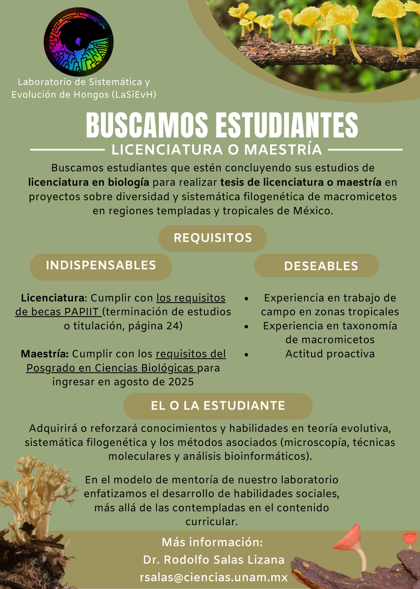

**Proyecto principal: Diversidad y sistemática filogenética de Agaricomycetes.**

**Diversidad y sistemática filogenética de hongos clavarioides (Agaricomycetes,Basidiomycota) en regiones templadas, tropicales y subtropicales de México**

Los hongos en forma de clava o coral (clavarioides) son esenciales en los ecosistemas templados y tropicales, desempeñando roles cruciales como saprobios, formando ectomicorrizas con plantas o formando líquenes.

**Objetivos del proyecto** Con este proyecto buscamos maximizar el descubrimiento y la descripción de nuevas especies de estos hongos en México. Nos enfocamos en integrar información morfológica, genética y de autoecología, prestando especial atención a su estatus micorrícico y las plantas asociadas.

**Metodología** Utilizamos datos de metabarcoding de ADN ambiental del suelo para priorizar zonas de muestreo. Además, revisamos ejemplares de colecciones científicas y realizamos nuevas colectas en regiones estratégicas templadas, tropicales y de transición tropical-templada, incluyendo esporomas y raíces con ectomicorrizas. Esto nos permitirá establecer relaciones entre hongos y plantas hospederas y confirmar su estatus ecológico.

**Contribuciones** Estamos generando datos de morfología, secuencias de ADN y metadatos que facilitarán el descubrimiento de especies y nuevos registros de los hongos clavarioides en el país. Compararemos nuestros hallazgos con datos previos para evaluar nuestra estrategia. Los resultados obtenidos en este proyecto ayudan a nutrir bases de datos de ADN y colecciones científicas, contribuyendo a la sistemática filogenética, ecología, evolución y conservación de estos hongos.

**Participa en nuestro proyecto** Si estás interesado o interesada en colaborar con nosotros, ¡te invitamos a ponerte en contacto! Estamos buscando estudiantes apasionados por la sistemática y taxonomía de macromicetos para unirse a nuestra investigación.

{width="50%" style="display: block; margin: 0 auto;"} **Otros proyectos:**

-   **Efectos del cambio del uso de suelo en hongos macromicetos saprobios y ectomicorrícicos.**
-   **Determinación de los participantes en la simbiosis de *Septobasidium spp.* con insectos coccideos y árboles de fresno.**
-   **Hongos clavarioides del Atlas de la biodiversidad del suelo de México.**

**Proyectos secundarios:**

-   **Demografía histórica y filogeografía de *Lophodermium* en Norteamérica (colaboración con la Universidad de California--Santa Barbara)**
-   **Hongos endófitos de raíz de plantas tropicales**
-   **Efectos de la contaminación por ozono en la composición taxonómica y funcional de las comunidades de hongos endófitos en abetos (colaboración con el IE, UNAM y CONABIO)**
