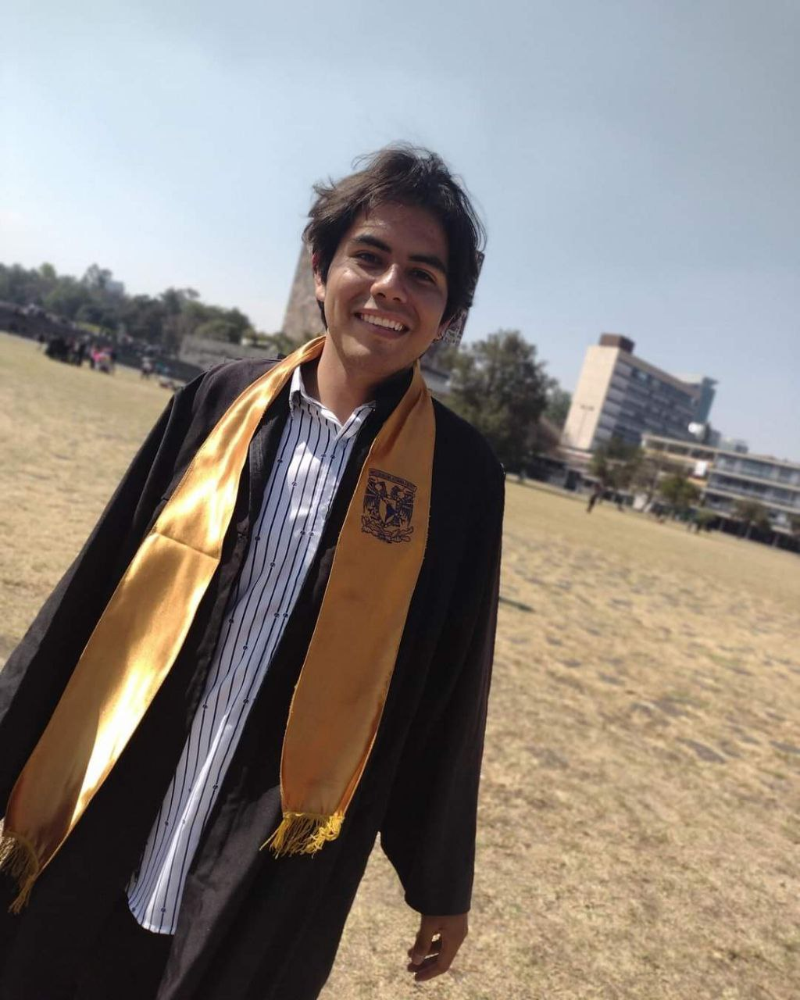
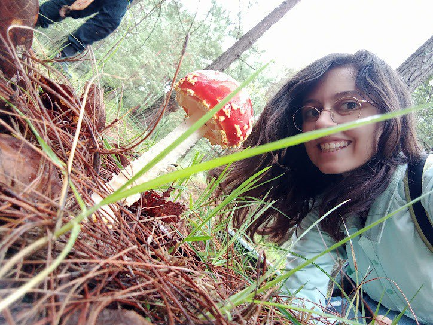

  <h2>Responsable del laboratorio</h2>
  <h3>Rodolfo Salas Lizana</h3>
   <!-- Cambia el ancho a 200px -->
   

  <h2>Estudiantes de licenciatura</h2>
  <table style="width: 100%; border-collapse: separate; border-spacing: 20px;">
    <tr>
      <td style="width: 50%; padding: 10px; vertical-align: top; text-align: center;">
        <h3>Norman Hernández</h3>
        
        

          Dentro del laboratorio estaré trabajando en un proyecto acerca de la determinación de los interactuantes en el parasitismo de <i>Septobasidium</i> y cóccidos sobre frenos. Me interesa mucho la divulgación científica, actualmente formo parte de un proyecto sobre divulgación. También me gustan demasiado los hongos y la antropología, especialmente la etnomicología.
        

      </td>

      <td style="width: 50%; padding: 10px; vertical-align: top; text-align: center;">
        <h3>Alejandro López</h3>
        
        

          Actualmente trabajo en un proyecto acerca del género de hongos endófitos <i>Lophodermium</i>, y la evaluación de patrones de especificidad hacia hospederos del género de plantas <i>Pinus</i>. Me interesa mucho la investigación científica, al igual que la enseñanza. Me gustan mucho los hongos, plantas, insectos, pero me gusta aprender acerca de cualquier organismo.
        

      </td>
    </tr>
    <tr>
      <td style="padding: 10px; vertical-align: top; text-align: center;">
        <h3>Sandra Hernández</h3>
        
        

          Para mi proyecto de licenciatura estoy trabajando con datos genéticos de <i>Lophodermium nitens</i>, para encontrar huellas de selección natural en los mismos. Me interesa el campo de la bioinformática en general así como el análisis de datos y la representación de éstos de manera gráfica.
        

      </td>
      <td style="padding: 10px; vertical-align: top;">
        <!-- Aquí podrías incluir otro estudiante si lo deseas -->
      </td>
    </tr>
  </table>

  <h2>Estudiantes de maestría</h2>
  <table style="width: 100%; border-collapse: collapse;">
    <tr>
      <td style="width: 50%; padding: 10px; vertical-align: top; text-align: center;">
        <h3>Valeria Flores Almaraz</h3>
         <!-- Cambia el ancho a 200px -->
        

          Estudiante del Posgrado en Ciencias Biológicas de la UNAM. Mi proyecto trata sobre el uso de RNA-Seq y Metabarcoding para el estudio de comunidades de hongos endófitos asociados a la filósfera de individuos de <i>Abies religiosa</i> en un bosque periférico de la CDMX. Anteriormente trabajé en un proyecto de producción de inóculo miceliar del hongo ectomicorrízico <i>Laccaria trichodermophora</i>. Estoy muy interesada en el estudio de las interacciones Planta-Hongo mediante diferentes aproximaciones como el cultivo, la bioinformática y la estadística.
        

<li style="display: inline; margin-right: 10px;">
            
          </li>
          <li style="display: inline;">
            
          </li>
      </td>
      <td style="width: 50%; padding: 10px; vertical-align: top;">
        <!-- Espacio para otro estudiante -->
      </td>
    </tr>
  </table>

  <h2>Servicio Social</h2>

